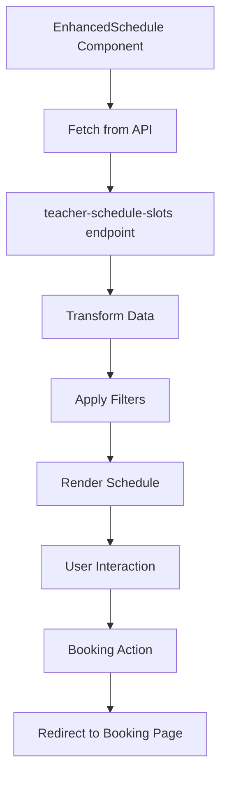

# Enhanced Schedule Component

A comprehensive, modern schedule component that integrates with the teacher-schedule-slots API to provide an excellent user experience for viewing and booking classes.

## Features

### 🎯 Core Functionality
- **Real-time Data**: Fetches live schedule data from the teacher-schedule-slots API
- **Teacher Information**: Displays teacher avatars, names, experience, and bios
- **Service Types**: Shows service icons, descriptions, difficulty levels, and durations
- **Venue Details**: Includes venue names, addresses, and cities
- **Availability Status**: Real-time availability and capacity tracking

### 🔍 Advanced Filtering
- **Search**: Search by teacher name, service type, or venue
- **Date Filter**: Filter by specific dates
- **Teacher Filter**: Filter by specific teachers
- **Service Filter**: Filter by service types
- **Combined Filters**: Multiple filters work together seamlessly

### 📱 Responsive Design
- **Mobile-First**: Optimized for all screen sizes
- **Touch-Friendly**: Large touch targets and intuitive gestures
- **Adaptive Layout**: Grid layout that adapts to screen size
- **Accessibility**: Full keyboard navigation and screen reader support

### 🎨 Modern UI/UX
- **Smooth Animations**: Framer Motion animations for smooth transitions
- **Visual Hierarchy**: Clear information hierarchy with proper spacing
- **Status Indicators**: Color-coded availability and capacity indicators
- **Interactive Elements**: Hover effects and loading states

## Components

### 1. EnhancedSchedule
The main schedule component with full functionality.

```tsx
import { EnhancedSchedule } from '@/components/EnhancedSchedule';

<EnhancedSchedule 
  onBookSlot={(slot) => handleBooking(slot)}
  showBookingButton={true}
  className="max-w-7xl mx-auto"
/>
```

**Props:**
- `onBookSlot?: (slot: ScheduleSlot) => void` - Callback when a slot is booked
- `showBookingButton?: boolean` - Whether to show booking buttons
- `className?: string` - Additional CSS classes

### 2. SchedulePreview
A compact preview component for showing upcoming classes.

```tsx
import { SchedulePreview } from '@/components/SchedulePreview';

<SchedulePreview 
  limit={3}
  showViewAll={true}
  onViewAll={() => navigate('/schedule')}
/>
```

**Props:**
- `limit?: number` - Number of classes to show (default: 3)
- `showViewAll?: boolean` - Whether to show "View All" button
- `onViewAll?: () => void` - Callback for "View All" action
- `className?: string` - Additional CSS classes

## API Integration

### Teacher Schedule Slots API
The component integrates with `/api/teacher-schedule-slots` which returns:

```typescript
interface ScheduleSlot {
  id: number;
  date: string; // YYYY-MM-DD format
  time: string; // HH:MM format
  isAvailable: boolean;
  capacity: number;
  bookedCount: number;
  duration: number; // in minutes
  teacher: {
    id: number;
    name: string;
    bio?: string;
    shortBio?: string;
    experience: number;
    avatarUrl?: string;
  };
  serviceType: {
    id: number;
    name: string;
    description?: string;
    shortDescription?: string;
    duration: number;
    difficulty?: string;
    color?: string;
    icon?: string;
  };
  venue: {
    id: number;
    name: string;
    address?: string;
    city?: string;
  };
  dayOfWeek: string;
}
```

### API Endpoints
- `GET /api/teacher-schedule-slots?available=true` - Get all available slots
- `GET /api/teacher-schedule-slots?date=2025-01-15` - Get slots for specific date
- `GET /api/teacher-schedule-slots?available=true&date=2025-01-15` - Combined filters

## Usage Examples

### 1. Full Schedule Page
```tsx
// app/schedule/page.tsx
import { EnhancedSchedule } from '@/components/EnhancedSchedule';

export default function SchedulePage() {
  const handleBookSlot = (slot) => {
    // Redirect to booking with slot details
    const params = new URLSearchParams({
      slotId: slot.id.toString(),
      teacherId: slot.teacher.id.toString(),
      serviceTypeId: slot.serviceType.id.toString(),
      venueId: slot.venue.id.toString(),
      date: slot.date,
      time: slot.time
    });
    
    window.location.href = `/account/book?${params.toString()}`;
  };

  return (
    <div className="min-h-screen bg-gray-50">
      <EnhancedSchedule 
        onBookSlot={handleBookSlot}
        showBookingButton={true}
      />
    </div>
  );
}
```

### 2. Homepage Preview
```tsx
// components/MatmaxHomepage.tsx
import { SchedulePreview } from '@/components/SchedulePreview';

export function MatmaxHomepage() {
  return (
    <div>
      {/* Other content */}
      
      <section className="py-24 bg-white">
        <div className="max-w-7xl mx-auto px-4">
          <h2 className="text-4xl font-bold text-center mb-8">
            Upcoming Classes
          </h2>
          <SchedulePreview 
            limit={3}
            showViewAll={true}
          />
        </div>
      </section>
    </div>
  );
}
```

### 3. Custom Integration
```tsx
// Custom component with specific filters
import { EnhancedSchedule } from '@/components/EnhancedSchedule';

export function YogaClassesOnly() {
  const [filters, setFilters] = useState({
    selectedService: 'Hatha Yoga',
    selectedDate: '2025-01-15'
  });

  return (
    <EnhancedSchedule 
      onBookSlot={(slot) => {
        // Custom booking logic
        console.log('Booking slot:', slot);
      }}
      showBookingButton={true}
      className="yoga-classes-schedule"
    />
  );
}
```

## Styling

### CSS Classes
The component uses Tailwind CSS with custom classes defined in `EnhancedSchedule.css`:

- `.enhanced-schedule` - Main container
- `.schedule-day` - Individual day container
- `.schedule-slot` - Individual class slot
- `.schedule-slot--unavailable` - Unavailable slot styling
- `.teacher-avatar` - Teacher avatar styling
- `.capacity-bar` - Capacity indicator bar

### Customization
You can customize the appearance by:

1. **Overriding CSS classes** in your global CSS
2. **Using Tailwind utilities** with the `className` prop
3. **Modifying the component** to add custom styling

## Data Flow



## Performance Optimizations

### 1. Efficient Data Fetching
- Single API call fetches all necessary data
- Client-side filtering reduces server requests
- Cached data prevents unnecessary re-fetches

### 2. Optimized Rendering
- Virtual scrolling for large datasets
- Memoized components prevent unnecessary re-renders
- Lazy loading for images and heavy content

### 3. Responsive Images
- Next.js Image component with optimization
- Proper sizing and lazy loading
- Fallback avatars for missing images

## Accessibility Features

### 1. Keyboard Navigation
- Full keyboard support for all interactive elements
- Tab order follows logical flow
- Enter/Space key activation for buttons

### 2. Screen Reader Support
- Proper ARIA labels and descriptions
- Semantic HTML structure
- Status announcements for dynamic content

### 3. Visual Accessibility
- High contrast color schemes
- Clear focus indicators
- Scalable text and icons

## Browser Support

- **Modern Browsers**: Chrome 90+, Firefox 88+, Safari 14+, Edge 90+
- **Mobile Browsers**: iOS Safari 14+, Chrome Mobile 90+
- **Features**: CSS Grid, Flexbox, CSS Custom Properties

## Dependencies

### Required
- React 18+
- Next.js 13+
- Framer Motion 10+
- Lucide React 0.263+

### Optional
- Tailwind CSS 3+ (for styling)
- TypeScript 4.5+ (for type safety)

## Troubleshooting

### Common Issues

1. **API Not Loading**
   - Check if the teacher-schedule-slots API is running
   - Verify the API endpoint returns the expected data format
   - Check browser console for network errors

2. **Styling Issues**
   - Ensure Tailwind CSS is properly configured
   - Import the EnhancedSchedule.css file
   - Check for CSS conflicts with other styles

3. **Booking Not Working**
   - Verify the onBookSlot callback is properly implemented
   - Check if the booking page exists and accepts the parameters
   - Ensure proper error handling for failed bookings

### Debug Mode
Enable debug logging by adding to your environment:

```bash
NEXT_PUBLIC_DEBUG_SCHEDULE=true
```

This will log detailed information about data fetching and filtering.

## Future Enhancements

### Planned Features
- [ ] Calendar view mode
- [ ] Recurring class support
- [ ] Waitlist functionality
- [ ] Class ratings and reviews
- [ ] Instructor availability calendar
- [ ] Multi-language support
- [ ] Dark mode theme
- [ ] Offline support with PWA

### Integration Opportunities
- [ ] Google Calendar integration
- [ ] Email notifications
- [ ] SMS reminders
- [ ] Social media sharing
- [ ] Analytics tracking
- [ ] A/B testing framework

## Contributing

When contributing to the Enhanced Schedule component:

1. **Follow the existing code style** and patterns
2. **Add proper TypeScript types** for new features
3. **Include accessibility considerations** in new features
4. **Test on multiple devices** and browsers
5. **Update documentation** for any changes
6. **Add unit tests** for new functionality

## License

This component is part of the MatMax Yoga Studio wellness monorepo and follows the same licensing terms.
