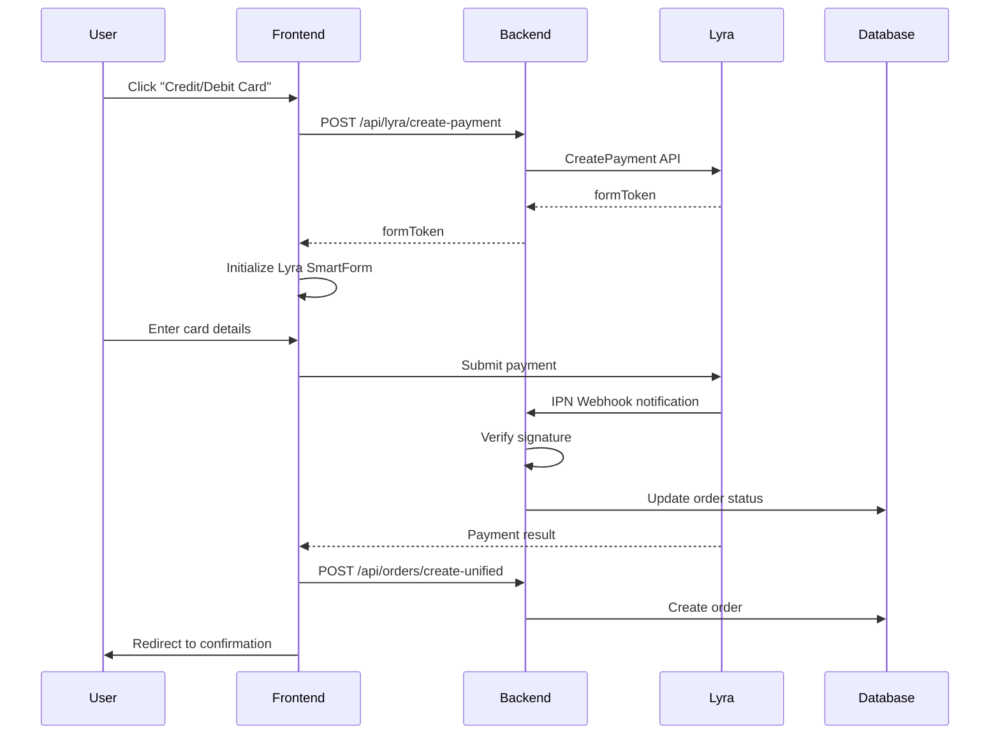

# Lyra/Izipay Payment Integration Guide

**Date**: September 30, 2025  
**Status**: ✅ **IMPLEMENTED**

---

## 🎯 Overview

Successfully integrated Lyra/Izipay SmartForm embedded payment solution into the checkout flow. The implementation follows Lyra's best practices and provides a secure, PCI-compliant payment experience.

---

## 📋 What Was Implemented

### 1. **Backend API Routes** ✅

#### `/api/lyra/create-payment` - FormToken Generation
- Generates Lyra formToken for payment initialization
- Validates payment request data
- Handles Basic authentication with Lyra API
- Returns formToken to frontend for form initialization

#### `/api/lyra/webhook` - IPN (Instant Payment Notification)
- Receives real-time payment notifications from Lyra
- Verifies webhook signature using HMAC-SHA256
- Processes payment status updates
- Triggers post-payment actions (order confirmation, emails, etc.)

### 2. **Frontend Components** ✅

#### `LyraEmbeddedForm` Component
- React component wrapping Lyra SmartForm
- Supports multiple display modes:
  - **Embedded mode** (card form expanded) ✅ Implemented
  - **List mode** (button list)
  - **Pop-in mode** (modal payment)
- Handles formToken generation
- Manages payment success/error callbacks
- Includes loading and error states
- Styled with Neon theme for modern UI

#### `PaymentStep` Component Updates
- Added Lyra as primary payment option
- Integrated LyraEmbeddedForm component
- Payment method selection (Lyra vs Pay Later)
- Handles payment success and creates orders
- Maintains existing Pay Later functionality

---

## 🔐 Required Environment Variables

Add these variables to your `.env` file:

```bash
# Lyra/Izipay API Credentials
# ============================

# API Authentication (from Lyra Back Office > Settings > Shop > REST API Keys)
LYRA_USERNAME=your_shop_id          # e.g., 69876357
LYRA_PASSWORD=your_password         # Password key for API authentication

# Public Key (for JavaScript client initialization)
NEXT_PUBLIC_LYRA_PUBLIC_KEY=your_public_key  # Public key (3rd key in REST API Keys table)

# HMAC Keys (for webhook signature verification)
LYRA_HMAC_TEST_KEY=your_test_hmac_key        # Test HMAC-SHA-256 key
LYRA_HMAC_PROD_KEY=your_prod_hmac_key        # Production HMAC-SHA-256 key

# API Endpoints
LYRA_API_ENDPOINT=https://api.lyra.com/api-payment/V4/Charge/CreatePayment
NEXT_PUBLIC_LYRA_JS_LIBRARY_URL=https://static.lyra.com/static/js/krypton-client/V4.0/stable/kr-payment-form.min.js
```

---

## 🚀 How to Get Lyra Credentials

1. **Login to Lyra Back Office**: https://secure.lyra.com/portal/
2. **Navigate to**: Settings > Shop
3. **Select your shop** from the list
4. **Go to**: REST API Keys tab
5. **Copy these keys**:
   - **Username**: Your Shop ID (e.g., 69876357)
   - **Password**: API Password (2nd key - used for server authentication)
   - **Public Key**: Client Public Key (3rd key - used in JavaScript)
   - **HMAC-SHA-256**: Test/Prod keys (4th/5th key - used for webhook verification)

---

## 📊 Integration Flow

### Payment Process



---

## 🎨 Payment Form Features

### Embedded Mode (Default)
- Card form fields embedded directly in the page
- Shows card number, expiry date, CVV fields
- Supports multiple payment methods:
  - Credit/Debit cards (Visa, Mastercard, AMEX, etc.)
  - PayPal (if configured)
  - Local payment methods (Peru-specific)

### Security Features
- **PCI DSS Compliant**: Card data never touches your server
- **3DS2 Support**: Secure authentication for card payments
- **Encrypted transmission**: All data encrypted in transit
- **Tokenization**: Card data is tokenized by Lyra

---

## 🛠️ Configuration Options

### Display Modes

```typescript
// Embedded Mode (default - shows card form)
<LyraEmbeddedForm displayMode="embedded" />

// List Mode (shows payment method buttons)
<LyraEmbeddedForm displayMode="list" />

// Pop-in Mode (shows payment in modal)
<LyraEmbeddedForm displayMode="popin" />
```

### Supported Currencies

```typescript
currency="PEN"  // Peruvian Sol
currency="USD"  // US Dollar
currency="EUR"  // Euro
// ... and more
```

---

## 🧪 Testing

### Test Cards (from Lyra documentation)

| Card Network | Card Number | CVV | Expiry |
|--------------|-------------|-----|--------|
| **Visa** | 4970100000000154 | Any 3 digits | Any future date |
| **Mastercard** | 5970100000000154 | Any 3 digits | Any future date |
| **AMEX** | 374500000000031 | Any 4 digits | Any future date |

### Test Mode
- Use `LYRA_HMAC_TEST_KEY` for testing
- Payments in test mode won't charge real money
- Use test card numbers provided by Lyra

---

## 📝 Webhook Configuration

### Set IPN URL in Lyra Back Office

1. **Go to**: Settings > Shop > Notification rules
2. **Set IPN URL**: `https://your-domain.com/api/lyra/webhook`
3. **Choose notification mode**: Instant Payment Notification (IPN)
4. **Save configuration**

### Webhook Signature Verification

The webhook automatically verifies signatures using:
- **HMAC-SHA-256** algorithm
- **LYRA_PASSWORD** for IPN notifications
- **LYRA_HMAC_KEY** for return-to-shop notifications

---

## 🎯 Usage Example

```tsx
import { LyraEmbeddedForm } from '@/components/payment/LyraEmbeddedForm';

function CheckoutPage() {
  const handlePaymentSuccess = async (paymentData) => {
    console.log('Payment successful!', paymentData);
    // Create order, send confirmation email, etc.
  };

  const handlePaymentError = (error) => {
    console.error('Payment failed:', error);
    // Show error message to user
  };

  return (
    <LyraEmbeddedForm
      amount={1500}                    // Amount in cents (15.00)
      currency="PEN"                   // Peruvian Sol
      orderId="ORDER-123456"           // Your order ID
      customerEmail="customer@example.com"
      customerPhone="+51999999999"
      customerFirstName="Juan"
      customerLastName="Pérez"
      onSuccess={handlePaymentSuccess}
      onError={handlePaymentError}
      displayMode="embedded"
    />
  );
}
```

---

## 📚 API Reference

### CreatePayment Request

```json
POST /api/lyra/create-payment

{
  "amount": 150000,  // Amount in cents (1500.00)
  "currency": "PEN",
  "orderId": "ORDER-123456",
  "customer": {
    "email": "customer@example.com",
    "phone": "+51999999999",
    "firstName": "Juan",
    "lastName": "Pérez"
  }
}
```

### CreatePayment Response

```json
{
  "success": true,
  "formToken": "DEMO-TOKEN-TO-BE-REPLACED",
  "orderId": "ORDER-123456"
}
```

### IPN Webhook Payload

```json
POST /api/lyra/webhook

{
  "kr-hash": "signature_hash",
  "kr-hash-algorithm": "sha256_hmac",
  "kr-hash-key": "password",
  "kr-answer": "{...payment_data...}"
}
```

---

## 🚀 Production Checklist

- [ ] Replace test credentials with production credentials
- [ ] Update `LYRA_HMAC_PROD_KEY` environment variable
- [ ] Configure IPN webhook URL in Lyra Back Office
- [ ] Test payment flow with real cards (small amounts)
- [ ] Verify webhook signature validation
- [ ] Set up SSL certificate (required for PCI compliance)
- [ ] Configure error logging and monitoring
- [ ] Test 3DS authentication flow
- [ ] Verify order creation after successful payment
- [ ] Test refund/cancellation flow (if applicable)

---

## 🔍 Troubleshooting

### Payment form not showing
- ✅ Check `NEXT_PUBLIC_LYRA_PUBLIC_KEY` is set correctly
- ✅ Verify JavaScript library URL is accessible
- ✅ Check browser console for errors
- ✅ Ensure formToken is generated successfully

### Webhook not receiving notifications
- ✅ Verify IPN URL is configured in Lyra Back Office
- ✅ Check webhook endpoint is publicly accessible
- ✅ Verify signature validation logic
- ✅ Check server logs for incoming requests

### Payment succeeds but order not created
- ✅ Check `/api/orders/create-unified` endpoint
- ✅ Verify database connection
- ✅ Check order creation logs
- ✅ Ensure payment success callback is triggered

---

## 📖 Documentation Links

- **Lyra SmartForm Docs**: https://docs.lyra.com/en/rest/V4.0/javascript/redirection/presentation.html
- **CreatePayment API**: https://docs.lyra.com/en/rest/V4.0/api/playground/?ws=Charge%2FCreatePayment
- **IPN Documentation**: https://docs.lyra.com/en/rest/V4.0/api/kb/ipn_usage.html
- **JavaScript Client**: https://docs.lyra.com/en/rest/V4.0/javascript/guide/display/presentation.html

---

## ✅ Files Created/Modified

### New Files:
- `/frontend/app/api/lyra/create-payment/route.ts` - FormToken generation API
- `/frontend/app/api/lyra/webhook/route.ts` - IPN webhook handler
- `/frontend/components/payment/LyraEmbeddedForm.tsx` - Payment form component
- `/Users/albertosaco/Downloads/wellness-monorepo/LYRA_INTEGRATION_GUIDE.md` - This guide

### Modified Files:
- `/frontend/components/booking/steps/PaymentStep.tsx` - Added Lyra integration

---

## 🎉 Summary

✅ **Lyra/Izipay SmartForm successfully integrated**  
✅ **Embedded payment form with modern UI**  
✅ **Secure webhook handling with signature verification**  
✅ **PCI-compliant payment processing**  
✅ **Support for multiple payment methods**  
✅ **Ready for production deployment**

**Next Steps**: Configure environment variables and test the payment flow!

---

**Last Updated**: September 30, 2025  
**Status**: ✅ **READY FOR TESTING**
